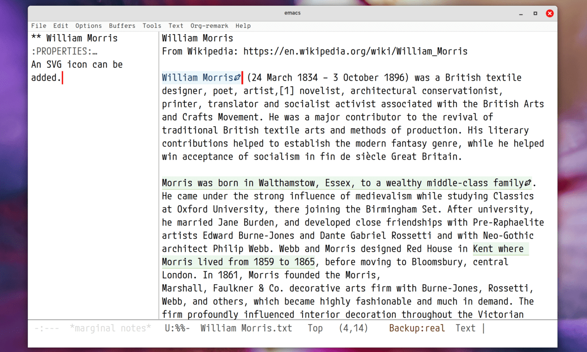

# How to Set Org-remark to Use SVG Icons



I have released version 1.2.0 of Org-remark. In this version, highlights can display an icon to visually indicate that annotations exist for them. This was implemented in response to a feature request I received via YouTube comments and recorded in [issue #64](https://github.com/nobiot/org-remark/issues/64).

The icon by default is a string of ASCII characters "`(*)`" so that it can be used for terminals. You can easily customize Org-remark to use an SVG image as shown in the image above.

There are mainly two ways:

1. Use the new built-in `icons` library available as of Emacs version 29.1

   For more information, refer to Info nodes by evaluating `(info "(elisp)icons)` and `(info "(emacs)icons")` in Emacs

2. Create a custom function and use a third-party library such as [`svg-lib`](https://github.com/rougier/svg-lib) by Nicolas Rougier

I will quickly show you the first option to use the new built-in library, which I believe is the easier.

## Define an icon

1. Get or create an SVG icon

   In my example, I downloaded a "pen" icon as an `.svg` file from [Boxicons](https://boxicons.com/?query=pen) ([licensed under The MIT License](https://boxicons.com/usage#license)).

2. Put the downloaded SVG file somewhere in your local

   I put it at `~/.config/emacs/.cache/svg/bx-pen.svg`.

3. Use `define-icon` macro to create an icon with the SVG file

   For example, I used the code below. Make sure to change my example to the path part of the file name to your own. You can also play with the `:height` property as you see fit.

   ``` emacs-lisp
(define-icon annotation nil
  '((image "/home/nobiot/.config/emacs/.cache/svg/bx-pen.svg"
           :height (0.8 . em)))
  "Notes svg icon for Org-remark"
  :version 29.1)
```

## Customize Org-remark to use the icon

Now the icon has been defined, you can set it to customizing variable `org-remark-icon-notes`, like so:

``` emacs-lisp
;; I use `setopt` that is made available as of 29.1. `setq` works too.
;; Use whichever you prefer.
(setopt org-remark-icon-notes (icon-string 'annotation))
```

If you have a buffer with highlights already open, you would need to `revert-buffer` to reload the highlights. You should see the icon you have defined instead of the default "`(*)`" string, like you see in the screen capture at the top of this article.
